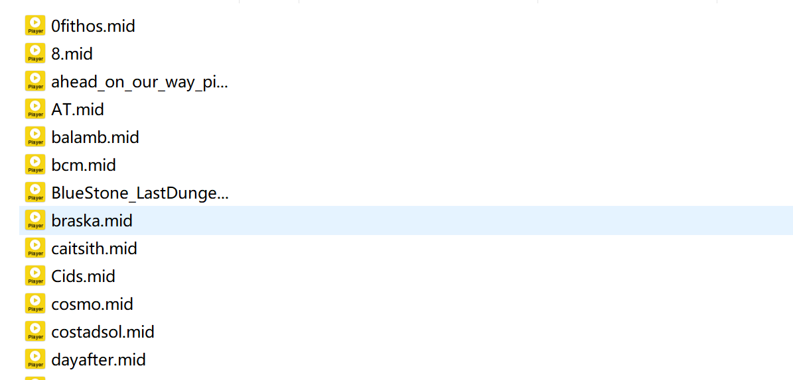
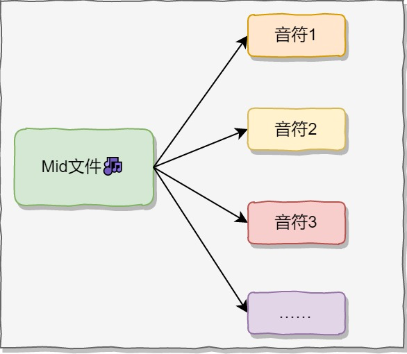
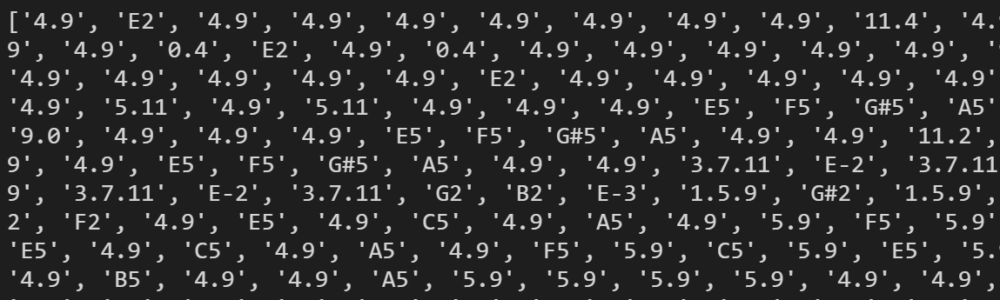
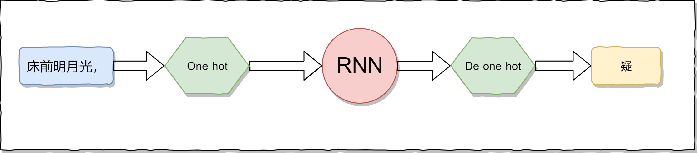
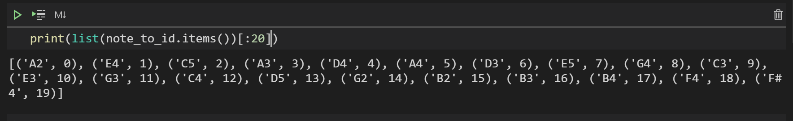
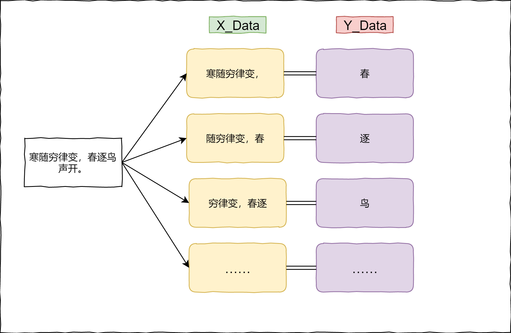
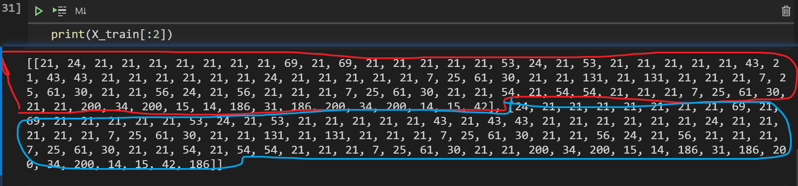
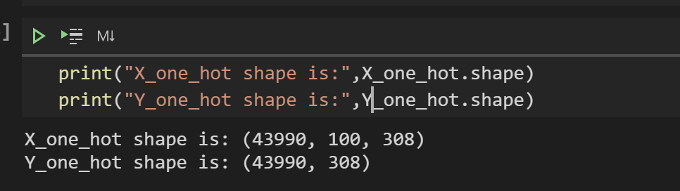
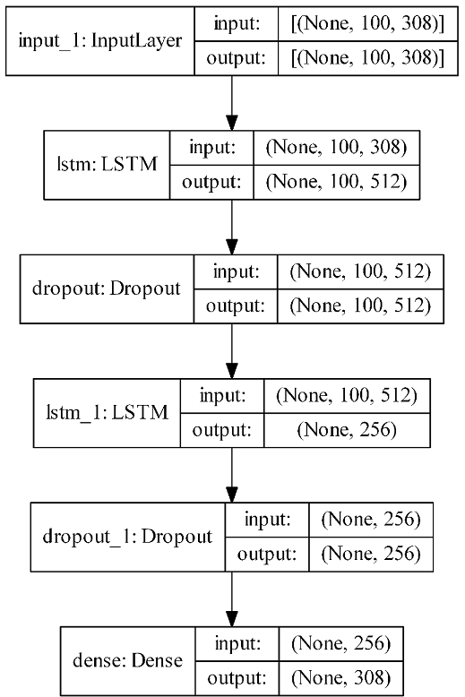
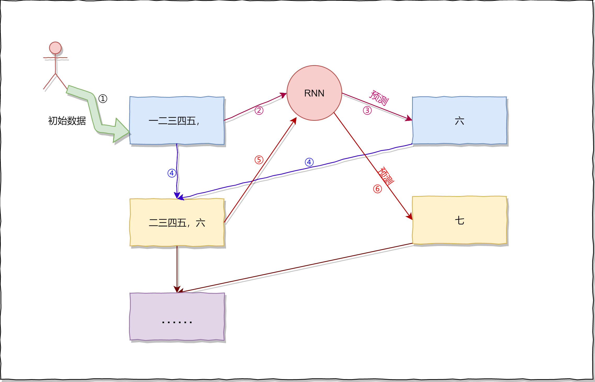

[TOC]

# LSTM机器学习生成音乐

​		在[网络流量预测入门（二）之LSTM介绍](https://www.cnblogs.com/xiaohuiduan/p/14338917.html)中对LSTM的原理进行了介绍，在[简单明朗的 RNN 写诗教程](https://www.cnblogs.com/xiaohuiduan/p/14330637.html)中介绍了如何使用keras构建RNN模型，然后生成五言唐诗。因此，如果对LSTM不了解，建议想去看一看LSTM相关的文章。

​		在这篇博客中，将介绍如何使用keras构建lstm模型，然后自动生成~~音乐~~。（当然这些音乐只是简单的纯音乐）

​		代码地址：[lstm-music](https://github.com/xiaohuiduan/lstm-music)：https://github.com/xiaohuiduan/lstm-music

​		生成的音乐：[auto_music](https://github.com/xiaohuiduan/lstm-music/blob/main/auto_music.mid)：https://github.com/xiaohuiduan/lstm-music/blob/main/auto_music.mid

​		实际上，使用LSTM生成音乐，与RNN生成诗词并没有什么很大的不同，原理都是相通的，而在[简单明朗的 RNN 写诗教程](https://www.cnblogs.com/xiaohuiduan/p/14330637.html)中，**详细**的介绍了代码的执行流程，感兴趣的可以借鉴参考。

> ​		下面关于音乐（或其组成）的解释，并不是很~~严谨~~（甚至可能是错误的），不过，在这篇博客的目的并不是为了来介绍音乐的组成以及原理，主要是为了使用LSTM，望勿怪。


## 数据集介绍

​		数据集来自[Classical-Piano-Composer](https://github.com/Skuldur/Classical-Piano-Composer)。部分数据如下所示，一共有92首音乐。



​		音乐是mid类型的文件，关于具体说明，参见[How to Generate Music using a LSTM Neural Network in Keras](https://towardsdatascience.com/how-to-generate-music-using-a-lstm-neural-network-in-keras-68786834d4c5)。

​		去繁化简，从最简单的角度来说，我们可以理解为<u>音乐</u>都是由<u>音符（note）</u>组成的就🆗了。



​		比如说，针对于*0fithos.mid*这首音乐，它由以下<u>音符（note）</u>组成：



​		上图中的每一个字符（如'4', 'C5', 'E5'），我们可以认为其为一个note。很多个note就组成了一首音乐。

​		因此，在这种情况下，应该定义两个函数，一个函数将mid文件转化成note数组，另一个函数则恰恰相反，将note数组转化成mid文件。

### 将mid转成note数组

​		下面定义`get_notes`，通过这个函数，我们可以将文件夹中所有mid文件变成**一个**名为`all_note`的数组。

> ​	关于具体怎么转化，实际上我们没有必要去关心，这个函数也是直接copy[基于深度学习lstm算法生成音乐](http://blueice.tech/2019/03/05/%E5%9F%BA%E4%BA%8E%E6%B7%B1%E5%BA%A6%E5%AD%A6%E4%B9%A0LSTM%E7%AE%97%E6%B3%95%E7%94%9F%E6%88%90%E9%9F%B3%E4%B9%90.html#%E4%BA%94%E7%94%9F%E6%88%90%E9%9F%B3%E4%B9%90)的，直接用即可。

```python
from music21 import converter, instrument, note, chord, stream

def get_notes(song_path,song_names):
    """获得midi音乐文件中的音符

    :param song_path: [文件的保存地址]
    :type song_path: [str]
    :param song_names: [所有音乐文件的文件名]
    :type song_names: [list]
    :return: [所有符合要求的音符]
    :rtype: [list]
    """
    all_notes = []
    for song_name in song_names:
        stream = converter.parse(song_path+song_name)
        instru = instrument.partitionByInstrument(stream)
        if instru:  # 如果有乐器部分，取第一个乐器部分
            notes = instru.parts[0].recurse()
        else:  #如果没有乐器部分，直接取note
            notes = stream.flat.notes
        for element in notes:
            # 如果是 Note 类型，取音调
            # 如果是 Chord 类型，取音调的序号,存int类型比较容易处理
            if isinstance(element, note.Note):
                all_notes.append(str(element.pitch))
            elif isinstance(element, chord.Chord):
                all_notes.append('.'.join(str(n) for n in element.normalOrder))
    return all_notes
```

### 将note数组转成mid文件

​		既然可以将mid文件转化成note数组，同理，也可以将note数组转成mid文件（也就是音乐）。定义一个`create_music`函数，同理这个函数也是copy[基于深度学习lstm算法生成音乐](http://blueice.tech/2019/03/05/%E5%9F%BA%E4%BA%8E%E6%B7%B1%E5%BA%A6%E5%AD%A6%E4%B9%A0LSTM%E7%AE%97%E6%B3%95%E7%94%9F%E6%88%90%E9%9F%B3%E4%B9%90.html#%E4%BA%94%E7%94%9F%E6%88%90%E9%9F%B3%E4%B9%90)的，同样也不需要关心其如何实现。

​		`create_music`函数在使用模型生成音乐的时候会用到（到后面看到的时候别懵逼了哦！！！！）。

```python
def create_music(result_data,filename):
    """生成mid音乐，然后进行保存

    :param result_data: [音符列表]
    :type result_data: [list]
    :param filename: [文件名]
    :type filename: [str]
    """
    result_data = [str(data) for data in result_data]
    offset = 0
    output_notes = []
    # 生成 Note（音符）或 Chord（和弦）对象
    for data in result_data:
        if ('.' in data) or data.isdigit():
            notes_in_chord = data.split('.')
            notes = []
            for current_note in notes_in_chord:
                new_note = note.Note(int(current_note))
                new_note.storedInstrument = instrument.Piano()
                notes.append(new_note)
            new_chord = chord.Chord(notes)
            new_chord.offset = offset
            output_notes.append(new_chord)

        else:
            new_note = note.Note(data)
            new_note.offset = offset
            new_note.storedInstrument = instrument.Piano()
            output_notes.append(new_note)
        offset += 1
    # 创建音乐流（Stream）
    midi_stream = stream.Stream(output_notes)
    # 写入 MIDI 文件
    midi_stream.write('midi', fp=filename+'.mid')
```


## 获取数据集并将其保存

​		通过前面的介绍，调用`get_notes`将使用music21库将**文件夹中所有的mid文件**变成**一个note数组**，但实际上这个过程是比较慢的，因此可以在第一次的时候将转换后的note数组保存起来，下面定义分别定义保存和读取的函数：

```python
def save_data(filename,content):
    """保存音符

    :param filename: [保存的文件名]
    :type filename: [str]
    :param content: [内容]
    :type content: [list]]
    """
    with open(filename,"w") as f:
        for data in content:
            f.write(str(data)+"\n")

def get_data(filename):
    """从文件中获取音符

    :param filename: [文件名]
    :type filename: [str]
    :return: [返回音符]
    :rtype: [list]
    """
    with open(filename) as f:
       all_notes = f.readlines()
    return [ note[:len(note)-1]  for note in all_notes]
```

​		接下来就是调用以上几个函数：将mid文件转成note数组——>将note数组进行保存。

```python
import os
song_path = "./midi_songs/"
song_names = os.listdir(song_path)

# 获取note数组
all_notes = get_notes(song_path,song_names)
# 保存文件
save_data("data.txt",all_notes)
```


### 将note进行编号

​		面对LSTM网络，当然不可能直接将音符喂给网络，在[简单明朗的 RNN 写诗教程](https://www.cnblogs.com/xiaohuiduan/p/14330637.html)中详细的介绍了原因，这里就不多赘述。

> 喂的数据是进行one-hot编码后的数据。



​		简单点来说，需要对音符进行one-hot编码，因此需要对note进行编号（比如说**"A5"**的编号是**0**，**“F5”**的编号是**4**）。

> 当**每一种**音符都有了id（序号）后，就可以很简单的对每一个note都进行one-hot编码了

```python
from collections import Counter
# 对出现过的note进行统计
counter = Counter(all_notes)
# 根据出现的次数，进行从大到小的排序
note_count = sorted(counter.items(),key=lambda x : -x[1])
notes,_ = zip(*note_count)
# 产生note到id的映射
note_to_id = {note:id for id,note in enumerate(notes)}
```

`note_to_id`的部分数据如下：




## 构建数据集


### 截取数据

​		构建数据集的过程原理同样在[简单明朗的 RNN 写诗教程](https://www.cnblogs.com/xiaohuiduan/p/14330637.html)详细说过，以诗为例，过程如下。



​		在上图中，一个`X_Data`的长度是6，这里我们取100。同时我们在取数据的同时将note转换成id。也就是说最后在`X_train`和`Y_train`中数据并不是~~note~~而是id。

```python
X_train = []
Y_train = []
sequence_batch = 100
for i in range(len(all_notes)-sequence_batch):
    X_pre = all_notes[i:i+sequence_batch]
    Y_pre = all_notes[i+sequence_batch]
    X_train.append([note_to_id[note] for note in X_pre])
    Y_train.append(note_to_id[Y_pre])
```

​		部分结果如下图所示：



### 进行one-hot编码

​		one-hot编码，这里我们直接使用keras提供工具。`X_one_hot`和`Y_one_hot`才是**最终**喂给LSTM的数据。

```python
from keras.utils import to_categorical
X_one_hot = to_categorical(X_train)
Y_one_hot = to_categorical(Y_train)
```




## 构建模型

模型图如下所示，



下面是我随便构建的网络模型：

```python
import keras
from keras.callbacks import ModelCheckpoint
from keras.models import Input, Model
from keras.layers import  Dropout, Dense,LSTM 
from keras.optimizers import Adam
from keras.utils import plot_model
# X_one_hot.shape[1:] = (100, 308)
input_tensor = Input(shape=X_one_hot.shape[1:])
lstm = LSTM(512,return_sequences=True)(input_tensor)
dropout = Dropout(0.3)(lstm)

lstm = LSTM(256)(dropout)
dropout = Dropout(0.3)(lstm)
# Y_one_hot.shape[-1] = 308
dense = Dense(Y_one_hot.shape[-1], activation='softmax')(dropout)

model = Model(inputs=input_tensor, outputs=dense)
# 画图
# plot_model(model, to_file='model.png', show_shapes=True, expand_nested=True, dpi=500)
optimizer = Adam(lr=0.001)
model.compile(loss='categorical_crossentropy', optimizer=optimizer, metrics=['accuracy'])
model.summary()import keras
from keras.callbacks import ModelCheckpoint
from keras.models import Input, Model
from keras.layers import  Dropout, Dense,LSTM 
from keras.optimizers import Adam
from keras.utils import plot_model
# X_one_hot.shape[1:] = (100, 308)
input_tensor = Input(shape=X_one_hot.shape[1:])
lstm = LSTM(512,return_sequences=True)(input_tensor)
dropout = Dropout(0.3)(lstm)

lstm = LSTM(256)(dropout)
dropout = Dropout(0.3)(lstm)
# Y_one_hot.shape[-1] = 308
dense = Dense(Y_one_hot.shape[-1], activation='softmax')(dropout)

model = Model(inputs=input_tensor, outputs=dense)
# 画图
# plot_model(model, to_file='model.png', show_shapes=True, expand_nested=True, dpi=500)
optimizer = Adam(lr=0.001)
model.compile(loss='categorical_crossentropy', optimizer=optimizer, metrics=['accuracy'])
model.summary()
```


## 训练

​		相比较于上一次的RNN写诗，这一次，我们可以将数据集全部放到内存中进行训练，因为此次数据集比较小，可以将其全部放到内存中。不过，还是建议将数据集放到GPU比较好的电脑上面跑（比如说，~~白嫖~~kaggle，hhh）。

```python
filepath = "./{epoch}--weights{loss:.2f}.hdf5"
checkpoint = ModelCheckpoint(
    filepath,
    monitor='loss',
    verbose=0,
    save_best_only=True,
    mode='min'
)
callbacks_list = [checkpoint]
model.fit(X_one_hot, Y_one_hot, epochs=100, batch_size=2048,callbacks=callbacks_list)
```


## 生成音乐

​		生成音乐的代码没什么好说的，原理与生成唐诗原理是一样的。生成唐诗的原理如下所示，只不过RNN变成了LSTM，同时数据的长度变成了100罢了。



​		

### 加载数据

​		在前面的操作中，通过`save_data`函数将数据集进行了保存（保存在data.txt文件中），因此，这一次可以直接从*data.txt*文件中读取数据。

```python
def get_data(filename):
    """从文件中获取音符

    :param filename: [文件名]
    :type filename: [str]
    :return: [返回音符]
    :rtype: [list]
    """
    with open(filename) as f:
       all_notes = f.readlines()
    return [ note[:len(note)-1]  for note in all_notes]
# 从保存的数据集中获得数据
all_notes = get_data("data.txt")
```

### 加载模型

​		在[GitHub](https://github.com/xiaohuiduan/lstm-music)中，已经提供了一个训练好的模型供大家使用，不过请尽量保持keras版本一致：`2.4.3`。

```python
# 加载模型
from keras.models import load_model
model = load_model("weights-804-0.01.hdf5")
```

### 构建id与note的映射

​		通过LSTM，predict出来的肯定不是一个音符，而是一个id，因此，需要构建一个id到note的映射：

```python
from collections import Counter
from keras.utils import to_categorical

counter = Counter(all_notes)
note_count = sorted(counter.items(),key=lambda x : -x[1])
notes,_ = zip(*note_count)
# note到id的映射
note_to_id = {note:id for id,note in enumerate(notes)}
# id到note的映射
id_to_note = {id:note for id,note in enumerate(notes)}
# 构建X_train，目的是为了实现随机从X_one_hot选择一个数据，然后进行predict 
X_train = []
sequence_batch = 100
for i in range(len(all_notes)-sequence_batch):
    X_pre = all_notes[i:i+sequence_batch]
    X_train.append([note_to_id[note] for note in X_pre])
X_one_hot = to_categorical(X_train)
```

### 预测下一个note

​		可以定义一个函数，目的是为了进行predict，函数接受长度为100的note数组，然后返回预测的**id**：

```python
def predict_next(X_predict):
    """通过前100个音符，预测下一个音符

    :param X_predict: [前100个音符]
    :type X_predict: [list]
    :return: [下一个音符的id]
    :rtype: [int]
    """
    prediction = model.predict(X_predict)
    index = np.argmax(prediction)
    return index
```

### 源源不断产生note数据

​		一首音乐当然不可能就101个音符（初始给的100个音符，然后通过这100个音符预测下一个音符），因此需要如下图所示，源源不断地进行预测。


​		下面定义`generate_notes`函数，目的就是为了产生音符长度为1000的音乐文件。

```python
import numpy as np
from music21 import converter, instrument, note, chord, stream
def generate_notes():
    """随机从X_one_hot抽取一个数据（长为100），然后进行predict，最后生成音乐

    :return: [note数组（['D5', '2.6', 'F#5', 'D3', ……]）]
    :rtype: [list]
    """
    # 随机从X_one_hot选择一个数据进行predict
    randindex = np.random.randint(0, len(X_one_hot) - 1)
    predict_input = X_one_hot[randindex]
    # music_output里面是一个数组，如['D5', '2.6', 'F#5', 'D3', 'E5', '2.6', 'G5', 'F#5']
    music_output = [id_to_note[id] for id in X_train[randindex]]
    # 产生长度为1000的音符序列
    for note_index in range(1000):
        prediction_input = np.reshape(predict_input, (1,X_one_hot.shape[1],X_one_hot.shape[2]))
        # 预测下一个音符id
        predict_index = predict_next(prediction_input)
        # 将id转换成音符
        music_note = id_to_note[predict_index]
        music_output.append(music_note)
        # X_one_hot.shape[-1] = 308
        one_hot_note = np.zeros(X_one_hot.shape[-1])
        one_hot_note[predict_index] = 1
        one_hot_note = np.reshape(one_hot_note,(1,X_one_hot.shape[-1]))
        # 重新构建LSTM的输入
        predict_input = np.concatenate((predict_input[1:],one_hot_note))
    return music_output
```

​		调用`generate_notes`函数，便可以产生一定长（1000）序列的note数组。

```python
predict_notes = generate_notes()
```


### 生成音乐

​		通过上一步，产生了一定长序列的note数组了，接在下，调用在前文定义的**将note数组转成mid文件**函数（`create_music`函数），便可以将note数组转换成音乐mid文件。

```python
create_music(predict_notes,"auto_music")
```

## 总结

​		以上，便是使用keras构建LSTM生成音乐的全部内容。实际上内容与[简单明朗的 RNN 写诗教程](https://www.cnblogs.com/xiaohuiduan/p/14330637.html)的过程差不多（可谓是大同小异）。

​		在借助keras API情况下，我们可以很轻松的使用几行代码便可以构建一个lstm模型，但实际上，真正重要的并不是我们如何调用keras的API写代码，而是几行代码后面的原理。

### 参考

- [基于深度学习lstm算法生成音乐](http://blueice.tech/2019/03/05/%E5%9F%BA%E4%BA%8E%E6%B7%B1%E5%BA%A6%E5%AD%A6%E4%B9%A0LSTM%E7%AE%97%E6%B3%95%E7%94%9F%E6%88%90%E9%9F%B3%E4%B9%90.html#%E4%BA%94%E7%94%9F%E6%88%90%E9%9F%B3%E4%B9%90)

- [How to Generate Music using a LSTM Neural Network in Keras](https://towardsdatascience.com/how-to-generate-music-using-a-lstm-neural-network-in-keras-68786834d4c5)

- [Want to Generate your own Music using Deep Learning? Here’s a Guide to do just that!](https://www.analyticsvidhya.com/blog/2020/01/how-to-perform-automatic-music-generation/#)

- [Classical-Piano-Composer](https://github.com/Skuldur/Classical-Piano-Composer)

- [简单明朗的 RNN 写诗教程](https://www.cnblogs.com/xiaohuiduan/p/14330637.html)

  